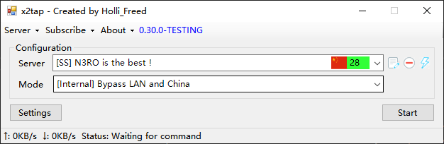

# x2tap

Can intercept all connections at the network layer and transfer them to Socks5, Shadowsocks, ShadowsocksR, V2Ray proxy

**The latest beta version was released in [releases](https://github.com/hacking001/x2tap/releases)**

[简体中文](docs/zh-CN/README.md)
## Screenshots

## Dependences
- [shadowsocksr-libev](https://github.com/shadowsocksrr/shadowsocksr-libev/tree/Akkariiin/develop)
- [shadowsocks-libev](https://github.com/shadowsocks/shadowsocks-libev)
- [dnscrypt-proxy](https://github.com/jedisct1/dnscrypt-proxy)
- [tap-windows](https://build.openvpn.net/downloads/releases/latest/tap-windows-latest-stable.exe)
- [v2ray-core](https://github.com/v2ray/v2ray-core/releases)
- [tun2socks](https://github.com/eycorsican/go-tun2socks)
- [x2tapCore](https://github.com/hacking001/x2tapCore)

## Mirrors
- [Github](https://github.com/hacking001/x2tap)
- [GitLab](https://gitlab.com/hacking001/x2tap)

## User Agreement
- Please use it in accordance with local laws and may not be used for illegal purposes