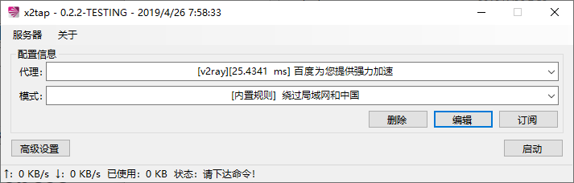

# x2tap
能在网络层拦截所有连接并转发给 Socks5、Shadowsocks、ShadowsocksR、V2Ray 代理

**最新测试版发布于 [releases](https://github.com/hacking001/x2tap/releases) 中**

# 截图

# 依赖
- [TAP-Windows](https://build.openvpn.net/downloads/releases/latest/tap-windows-latest-stable.exe)
- [shadowsocksr-native](https://github.com/ShadowsocksR-Live/shadowsocksr-native)
- [v2ray-core](https://github.com/v2ray/v2ray-core/releases)
- [dnscrypt-proxy](https://github.com/jedisct1/dnscrypt-proxy)
- [tun2socks](https://github.com/eycorsican/go-tun2socks)
- [x2tapCore](https://github.com/hacking001/x2tapCore)

# 技术核心
[CORE.md](CORE.md)

# 编译指南
参见 [BUILD.md](BUILD.md)

# 仓库镜像
- [Github](https://github.com/hacking001/x2tap)
- [GitLab](https://gitlab.com/hacking001/x2tap)

# 用户协议
- 请在遵循当地法律的情况下使用，不得用于违法用途